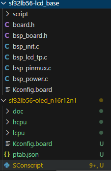

# 思澈板子文件创建
2025/7/21
目前思澈的板子创建，按照官方指定步骤创建板级文件，然后
可以在project目录下建一个同级的boards目录放板子
## 修改板子的名称
板子下的sconscript代码如下
```python
from building import *

cwd = GetCurrentDir()

src = Glob('./*.c')
path =  [cwd, 
         os.path.join(cwd, '../include')]

group = DefineGroup('Drivers', src, depend = ['BSP_USING_BOARD_SF32LB56_OLED_N16R12'], CPPPATH = path)
board_path = os.path.abspath(os.path.join(cwd, '../sf32lb52-oled_V0.7/SConscript'))
print("path:",  board_path)
print(os.listdir(os.path.dirname(board_path)))


if GetDepend('BSP_USING_BOARD_SF32LB56_OLED_N16R12'):
    group = group + SConscript(board_path, variant_dir="base", duplicate=0)
    # print('board:',group)


Return('group')
```
需要依赖部分的名称，即`BSP_USING_BOARD_SF32LB56_OLED_N16R12`,改为自己的板子名称，同时还需要修改kconfig里的板子名称，在vscode中全局搜索要修改的项目，大概是有四个，全部替换为新的名称，此外在kconfig.board 中修改路径包含为相对路径，写法大概类似于这样
`rsource "../sf32lb52_oled_v0.8/Kconfig.board"`

在base板级目录，需要将sConscript 放置在文件夹根目录下


将base目录下的sconscript修改为以下内容

```python
from building import *

cwd = GetCurrentDir()

src = Glob('*.c')

path =  [os.path.join(cwd, ".")]

group = DefineGroup('Drivers', src, depend = [], CPPPATH = path)

Return('group')
```

## 修改boards目录下的Sconscript
```python
# for module compiling
import os
from building import *

cwd  = GetCurrentDir()
objs = []
list = os.listdir(cwd)
if GetDepend(['BSP_USING_RTTHREAD']):
    if not GetDepend(['BSP_USING_PC_SIMULATOR']):
        if not GetDepend(['BSP_USING_BUILTIN_LCD']):
            # include all subfolder
            for d in list:
                path = os.path.join(cwd, d)
                if os.path.isfile(os.path.join(path, 'SConscript')):
                    objs = objs + SConscript(os.path.join(d, 'SConscript'))
else:
    objs = objs + SConscript(os.path.join('pmic_controller', 'SConscript'))
    
Return('objs')
```
